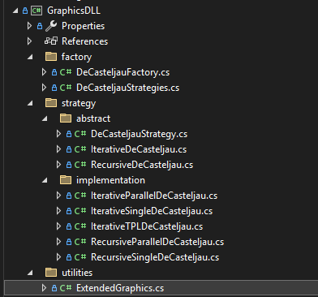
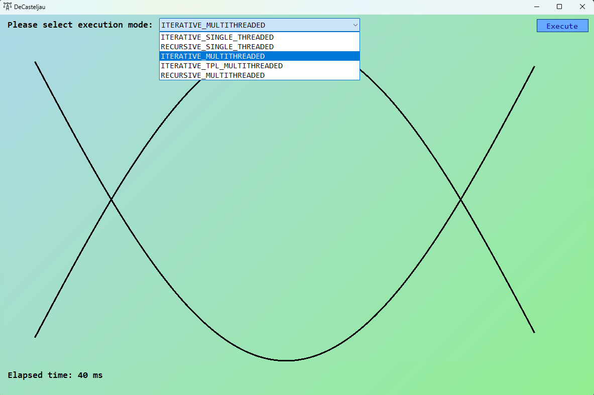

# Szoftverfejlesztés párhuzamos architektúrákra

**Nagy-Tóth Bence DZKBX0**

## A DeCasteljau algoritmus párhuzamosítása

<!-- DeCasteljau algoritmusról írni -->

A DeCasteljau algoritmus különböző megvalósításait C# nyelven írtam meg, egy DLL-állomány készült ezekből, amelynek metódusait egy Windows Forms-os grafikus felületen, illetve egy konzolos alkalmazásból használtam. Féléves feladatom forráskódja [ezen a Github linken](https://github.com/nagytoth1/decasteljau-parallel.git) keresztül elérhető.

Három eltérő megoldást készítettem a DeCasteljau algoritmus párhuzamosításra. Minden módszer egy adott stratégiát alkalmaz a számítások párhuzamosítására, különböző szinkronizálási és teljesítmény-optimalizációs technikákkal.

## GraphicsDLL állomány

Ez a DLL projekt tartalmazza a különféle megvalósításokat a DeCasteljau algoritmus futtatására, amelyeket a Factory és Strategy tervezési minták használatával rendszereztem. A célom alapvetően az volt, hogy a kódot karbantarthatóvá és könnyen bővíthetővé tegyem, hogy a későbbiekben egyszerűbben hozzáadhassunk újabb végrehajtási módokat anélkül, hogy a többi, ettől függő logikát módosítani kellene.

A Factory minta segít az algoritmusok típusának dinamikus kiválasztásában és létrehozásában. A Strategy minta pedig lehetővé teszi, hogy különböző végrehajtási módszereket (pl. iteratív, párhuzamos, rekurzív-párhuzamos) válasszunk ki és használjunk dinamikusan.

### A GraphicsDLL projekt könyvtárstruktúrája

A következő könyvtárstruktúrát hoztam létre a jobb átláthatóság miatt:



- **factory**: A `DeCasteljauFactory.cs` felelős a végrehajtási stratégiák példányosításáért, míg a `DeCasteljauStrategies.cs` enum típusként tartalmazza a különböző elérhető stratégiai osztályokat, amelyek között a felhasználó választhat.

- **strategy**: Strategy pattern megvalósítását tartalmazó könyvtár, a DeCasteljau algoritmusok különböző megvalósításai itt találhatóak.

  - **abstract**: Absztrakt osztályokat tartalmazó könyvtár. Az absztrakt `DeCasteljauStrategy.cs` osztály tartalmazza a DeCasteljau algoritmus bemeneti paramétereit, illetve egy `Iterate` függvényt, amelyet a konkrét implementációs gyermekosztályoknak kell implementálniuk. További két absztrakt osztály is megtalálható itt (`IterativeDeCasteljau.cs` és a `RecursiveDeCasteljau.cs`), mivel voltak a rekurzív illetve az iteratív implementációknak közös, átfedő függvényei, kódduplikáció elkerülése miatt öröklődéssel adtam le az implementáló osztályoknak.

  - **implementation**: Az egyes algoritmusok konkrét implementáló osztályai találhatóak ebben a könyvtárban.

- **utilities**: A `ExtendedGraphics.cs` osztály segít a grafikus megjelenítésben, biztosítva a DeCasteljau algoritmus lépéseinek vizualizációját.

Volt egy olyan pont a fejlesztés során, amikor szükségessé vált a DeCasteljau algoritmusok átalakítása azért, hogy ténylegesen mérni tudjuk a párhuzamosítás hatásosságát. A célom az volt, lehetőséget adjak a `GraphicsDLL` használatára a CLI (parancssori) és Windows Forms felületek felől. Ekkor jól jött a Factory és Strategy tervezési minták adta előny, a rendszerezett osztálystruktúra segített abban, hogy csak ott kellett módosítanom az implementációimat, ahol ténylegesen szükséges volt, a felhasználó, már meglévő Form kódja nem borult fel teljesen például, csak az absztrakt hívások módosulásainak volt kitéve.

### Párhuzamosítási módszerek

Párhuzamosítási ötlet: Különböző t-értékekkel biztosítjuk, hogy a görbe teljes alakját kirajzoljuk, a különböző t-paraméterekkel végzett DeCasteljau számítások nem ütköznek egymásba, ezek egymástól függetlenek.

<!-- todo: befejezni -->

1. IterativeParallelDeCasteljau
2. IterativeTPLDeCasteljau
3. RecursiveParallelDeCasteljau: Task Parallel Library

- Task.Run() segítségével minden egyes új t értékre új szálat indítottam, az ily módon létrehozott Task objektumokat listába gyűjtöttem.
- A futtatott Task objektumok eredményeit bevárom, majd a függvény végén visszatérek az eredményekkel. Az eredmény egy görbe pontjait tartalmazó tömb, amelyet a Graphics osztály segítségével Formon meg is tudunk jeleníteni.
- A rajzolási műveleteket elkerültem azzal, hogy azokat a párhuzamosítás során kiszedtem, így a párhuzamos szálak feladata csak a görbe egyes pontjainak kiszámítására redukálódott, így egy `lock(g)` zárolást megspóroltam. A rajzolást utólag, szekvenciálisan, a kiszámított pontok ismeretében végezzük.

## Elkészült Windows Forms grafikus felület

Grafikus felületet készítettem arra, hogy különböző DeCasteljau végrehajtási módszereket vizuálisan is láthassuk, hogy megegyeznek, ugyanazon kontrollpontokra végezzük.


## Párhuzamosítási módszerek összehasonlítása

Egy konzolos alkalmazást készítettem, hogy pontosabb képet kaphassunk a különböző algoritmusok futási idejéről a grafikus felület méréséhez képest. Ez az alkalmazás a grafikus felület által is használt DLL állományban található DeCasteljau-algoritmusokat futtatja.

Tesztjeim során 10 egymást követő futtatás átlagos futási idejét mértem, hogy csökkentsem az egyes futtatások közötti ingadozások hatását, amely ingadozások természetesek a rendszer teljesítménye, a háttérfolyamatok vagy a memóriakezelés eltérései miatt. Ügyeltem rá, hogy Release típusú buildet használjak, mivel ez a build fordítói optimalizálásokat végez, amelyek jobb teljesítményt adnak a kód futását tekintve, ellentétben a Debug builddel. A következő konzolos kimeneten látható egyik tesztem eredménye:

```bash
DeCasteljau Execution Times (ms) - Average of 10 consequent executions:
--------------------------------------------------------
Strategy                            Execution Time (ms)
--------------------------------------------------------
Iterative Single DeCasteljau          167,1548
Iterative Parallel DeCasteljau         40,2980
Iterative TPL DeCasteljau              40,4137
Recursive Parallel DeCasteljau         52,8786
--------------------------------------------------------
Speedup with Parallel.For: 4,15
Speedup with TPL: 4,14
Speedup with Recursive + TPL: 3,16
```

A különböző végrehajtási módok 200 kontrollponttal lettek tesztelve, és a t paraméter lépésköze 0.001 volt (ez 1000 DeCasteljau-iterációt jelent, grafikusan finomabb felbontású görbéket eredményezve), hogy biztosítsunk mérhető nagyságrendű számítási feladatot, miközben a párhuzamosítási stratégiák hatását pontosabban mérhetjük (ezen a szinten a szálkezelés overheadjei elhanyagolhatóak).

A következő eredmények születtek a különböző párhuzamosítási technikák alkalmazása során:

- Parallel.For alkalmazása esetén a teljesítmény 4,16-szoros növekedést mutatott a szekvenciális verzióhoz képest.

- TPL (_Task Parallel Library_) alkalmazása 4,25-szörös gyorsulást eredményezett, ami azt jelenti, hogy a TPL képes jobb párhuzamos végrehajtást biztosítani, mint a Parallel.For, különösen a dinamikus feladatkezelés és a finomabb vezérlés miatt.

- A rekurzív párhuzamosítási módszer, bár hasznos, csupán 3,63-szoros gyorsulást eredményezett, ami arra utal, hogy a rekurzív hívások overheadje jelentősen csökkenti a párhuzamosítás hatékonyságát.

### Összegzés:

Összességében a Parallel.For és a TPL módszerek biztosították a legnagyobb gyorsulást, és bár mindkét megoldás jól teljesített, a TPL jobb finomhangolást és rugalmasságot kínál, míg a Parallel.For egyszerűbb implementációval és az optimális szálkezelésével előnyösebb választásnak tűnt. A rekurzív DeCasteljau párhuzamosított változata, bár szintén hozott jelentős javulást a szekvenciális futtatáshoz képest, csupán 3,63-szoros gyorsulást eredményezett, amely elmarad a többi módszertől.
